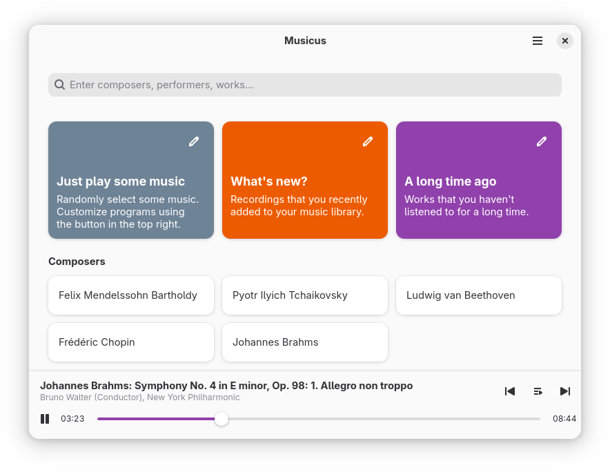
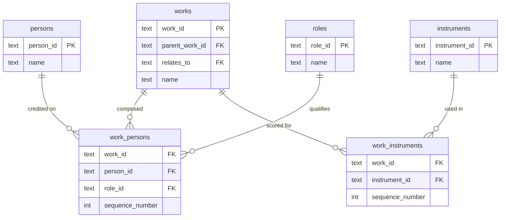
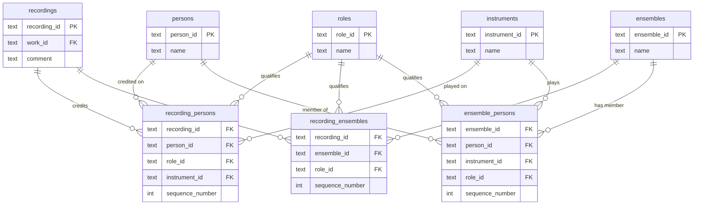
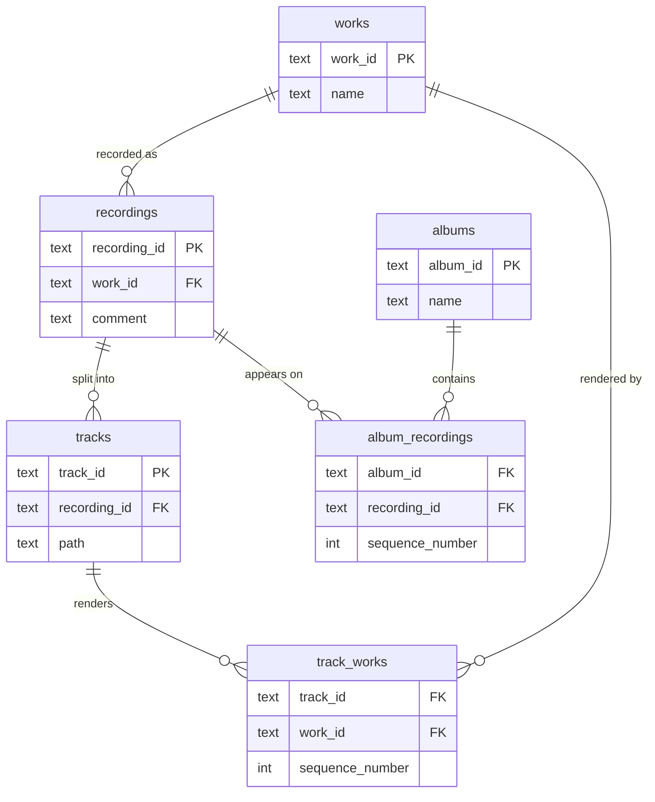
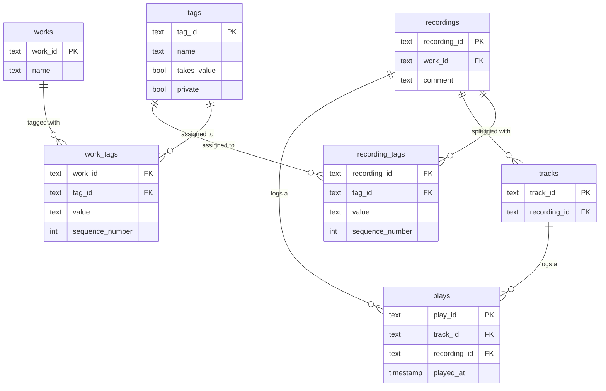

# Musicus

## Introduction

Musicus is a classical music player and organizer designed for the
[GNOME](https://www.gnome.org)
platform. It helps you manage your personal collection of classical music
recordings. Musicus also comes with a pre-made sample library of public domain
recordings, which you can use as a starting point or to test the application.

The following features make Musicus special:

 - Combination of library management, search and playback
 - Metadata handling optimized for classical music
 - Intelligent random playback with customizable programs
 - Built-in sample library for just listening to music right-away
 - Local-first, no cloud or account required

Please note that Musicus will not be ready for everyone until version 1.0 is
released. Before then, the format of the music library may change, which could
result in permanent data loss. Do not use the Musicus library as your primary
music collection!



## Hacking

### ORM

This program uses [Diesel](https://diesel.rs) as its ORM. After installing
the Diesel command line utility, you will be able to create a new schema
migration using the following command:

```
$ diesel migration generate [change_description]
```

To update the `src/db/schema.rs` file, you should use the following command:

```
$ diesel migration run --database-url test.sqlite
```

This file should never be edited manually.

### Schema overview

This is an overview of the database schema used by Musicus. Every entity
also carries `created_at`, `edited_at`, `last_used_at`, `source` and
`enable_updates` bookkeeping columns, which are omitted here for clarity.

#### Works, composers, instruments

Works form a tree of work parts (`parent_work_id`) and can point at a related
work, e.g. an arrangement (`relates_to`). Composers, arrangers and the like
are credited on the work itself, each qualified by a role; instrumentation is
recorded separately.



#### Recordings, performers, ensembles, instruments

Performers are credited on a recording independently of the work's own
composer credits, each qualified by a role and optionally an instrument.
Ensembles are credited the same way, and their own members are credited on
the ensemble itself.



#### Works, recordings, tracks, albums

A work is recorded as one or more recordings, each split into tracks. A track
can belong to more than one work, which happens when a recording runs
movements together without a break. Albums group recordings independently of
how their tracks are organized on disk.



#### Tags and listening history

Tags can be attached to both works and recordings, optionally carrying a
value (e.g. a "Year" tag with `takes_value` set). Plays are logged per track
when known, and always per recording; the `*_last_played` views aggregate
`plays` for every other entity.



### Internationalization

Execute the following commands from the project root directory to update
translation files whenever translatable strings have been changed.

1. Update `po/POTFILES`

    ```bash
    cat <<EOF > po/POTFILES
    data/de.johrpan.Musicus.desktop.in.in
    data/de.johrpan.Musicus.gschema.xml.in
    EOF

    find data/ui -name "*.blp" >> po/POTFILES
    find src musicus-library/src -name "*.rs" -a ! -name "config.rs" >> po/POTFILES
    ```

2. Update `po/template.pot`

    ```bash
    xgettext \
        --from-code=UTF-8 \
        --add-comments \
        --keyword=_ \
        --keyword=C_:1c,2 \
        --files-from=po/POTFILES \
        --output=po/template.pot
    ```

3. Update translation files

    ```bash
    msgmerge \
        --update \
        --backup=off \
        --no-fuzzy-matching \
        po/de.po \
        po/template.pot
    ```

### Building

#### Flatpak

```
flatpak-builder --repo=repo --force-clean build-dir flatpak/de.johrpan.Musicus.Devel.json
flatpak build-bundle repo de.johrpan.Musicus.Devel.flatpak de.johrpan.Musicus.Devel
flatpak install --user de.johrpan.Musicus.Devel.flatpak
```

#### Meson

```
meson setup _build --prefix="$HOME/.local"
ninja -C _build install
```

Ensure that `$HOME/.local/bin` is in `$PATH` and run the `musicus`
executable.

#### Windows

You will need MSYS2 installed.

Install Rust using `rustup` on your Windows system and switch to the
`x86_64-pc-windows-gnu` toolchain. Make sure `$USERPROFILE/.cargo/bin` is in
`$PATH` within your MSYS2 shell.

Install the dependencies:

```
pacman -S mingw-w64-ucrt-x86_64-gtk4 \
          mingw-w64-ucrt-x86_64-libadwaita \
          mingw-w64-ucrt-x86_64-gstreamer \
          mingw-w64-ucrt-x86_64-gst-plugins-base \
          mingw-w64-ucrt-x86_64-gst-plugins-good \
          mingw-w64-ucrt-x86_64-gst-libav \
          mingw-w64-ucrt-x86_64-gettext \
          mingw-w64-ucrt-x86_64-pkgconf \
          mingw-w64-ucrt-x86_64-gcc \
          mingw-w64-ucrt-x86_64-meson \
          mingw-w64-ucrt-x86_64-ninja \
          mingw-w64-ucrt-x86_64-python \
          mingw-w64-ucrt-x86_64-sqlite3 \
          zip
```

Install blueprint-compiler using PIP:

```
sudo pacman -S mingw-w64-ucrt-x86_64-python-pipx
pipx install blueprint-compiler
```

Make sure `$USERPROFILE/.local/bin` is in `$PATH`.

Build using Meson:

```
meson configure _build --prefix=$PWD/_build/install
ninja -C _build install
```

Run the application for testing:

```
export GSETTINGS_SCHEMA_DIR="$PWD/_build/install/share/glib-2.0/schemas"
export XDG_DATA_DIRS="$PWD/_build/install/share:$XDG_DATA_DIRS"
_build/install/bin/musicus.exe
```

Package the application:

```
bash build-aux/windows-package.sh
```

This will output a relocatable output directory `musicus_windows_portable` and
create `musicus_windows_portable.zip`.